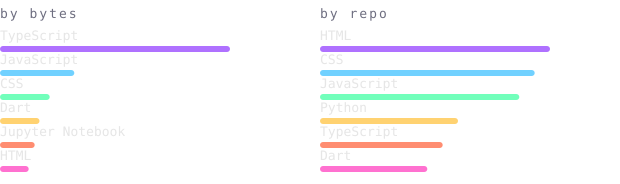
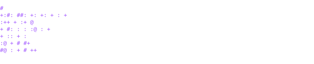

<h2>Hi, I'm Ayush Kumar Singh</h2>

[instagram](https://instagram.com/theydontknowakr) &nbsp;·&nbsp;
[linkedin](https://www.linkedin.com/in/ayushkumarjsr/) &nbsp;·&nbsp;
[x](https://x.com/akrverse)

> CSE student focused on AI/ML and Flutter, based in Jharkhand, India. 
> Small, sharp tools over big vague ideas.

Co-founder at Ayuda. Right now I'm building 
**Embryogen** — an AI-powered clinical decision support system for IVF embryo 
assessment — and a fake-image detection pipeline (Node/Express, Google Cloud 
Vision, perceptual hashing). Outside of that, competitive programming and chess.

<samp>python &nbsp; dart &nbsp; typescript &nbsp; javascript &nbsp; java &nbsp; react &nbsp; flutter &nbsp; node &nbsp; express &nbsp; mongodb &nbsp; firebase &nbsp; pytorch &nbsp; tensorflow &nbsp; scikit-learn &nbsp; docker &nbsp; git</samp>

**[Algorithm Arena V2](https://github.com/ayush6447)** &nbsp;·&nbsp; <samp>react, express, mongodb</samp> 
Competitive programming platform. Firebase auth, rate limiting, audit 
logging on admin actions, username claim onboarding.

**Embryogen** &nbsp;·&nbsp; <samp>python, ml</samp> 
Clinical decision support for IVF embryo assessment — model-backed 
scoring to help embryologists compare candidates.

**Fake Image Detection** &nbsp;·&nbsp; <samp>node, cloud vision</samp> 
Detects manipulated/AI-generated images using Google Cloud Vision, 
perceptual hashing, and a Next.js review frontend.

**[Portfolio](https://github.com/ayush6447/Portfolio-web)** &nbsp;·&nbsp; <samp>react, tailwind, framer motion</samp> 
Personal site with a 3D interactive tech-icon cloud, WebGL particle 
background, and click-spark effects.

Nothing on this page is embedded from a third-party service. The stat 
graphics and the section headings above are drawn by 
[a scheduled action](.github/workflows/stats.yml) straight from the GitHub 
GraphQL and REST APIs, once a day, committing only what changed.

The headings are SVGs because GitHub strips `<style>`/CSS from READMEs — 
an image is the only way to put this page's own typeface on them. The 
typeface is [JetBrains Mono](scripts/fonts), subset per-graphic to just the 
characters it draws and inlined as base64, so each SVG stays self-contained 
and nothing here can rate-limit or go dark.

Language totals in `langs.svg` cover public, non-fork repositories only. 
`year.svg` buckets each day's commit count into a quiet-to-loud ramp: 
`:` `+` `#` `@`.
